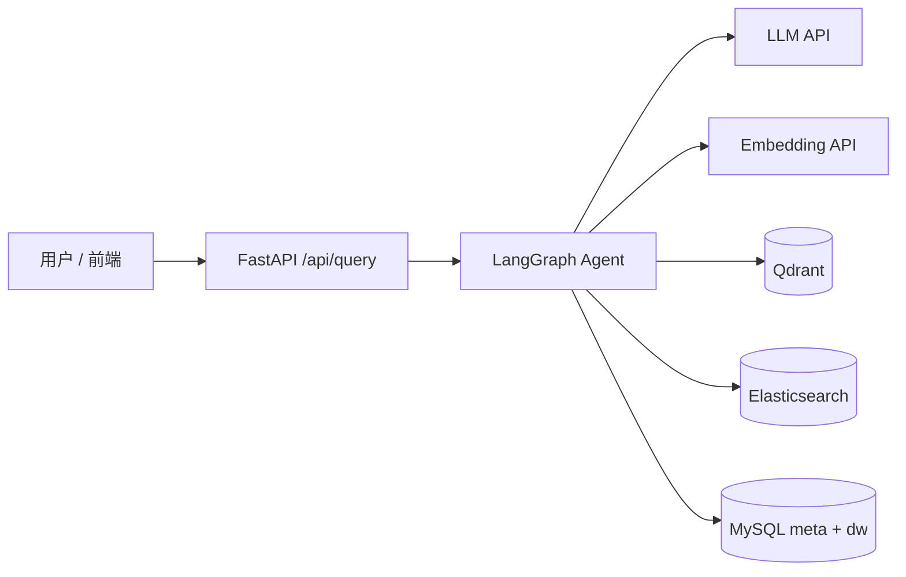

# Shopkeeper Agent

基于 **LangGraph + FastAPI** 的电商 NL2SQL 智能问数 Agent。用户用自然语言提问，系统自动完成 schema 召回、SQL 生成、校验修正与执行，并通过 SSE 流式返回过程与结果。

配套 **React + Vite** 前端，提供聊天式问数界面与 Agent 步骤可视化。

## 主要改进点

本项目基于 [didilili/shopkeeper-agent](https://github.com/didilili/shopkeeper-agent) 进行开发与优化，在保留原项目优秀架构的基础上，针对 Agent 能力和工程化方向进行了以下改进：

- **强化 SQL 自动修正循环（Correction Loop）**  
  将原项目中“校验失败后仅修正一次”的单次分支，改造为可控的 `validate_sql ⇄ correct_sql` 循环，并通过 `max_correction_attempts` 限制最大修正次数（默认 3）。新增 `sql_correction_failed` 节点，在达到最大次数后优雅返回结构化错误信息，提升了 SQL 生成的鲁棒性。

- **多轮对话与状态管理优化**  
  进一步完善了基于 LangGraph `MemorySaver` 的持久化机制，优化了 `rewrite_query` 节点的上下文改写逻辑，使多轮追问体验更稳定。

- **元数据知识库构建工程化改进**  
  封装了知识库清理与重建方法，支持在构建前清理 Qdrant、Elasticsearch 和 MySQL 中的旧数据，避免重复构建导致的数据混乱，提升了知识库构建的安全性和可重复性。

- **代码结构与验证能力增强**  
  对部分模块进行了职责梳理，增加验证脚本（`verify_correction_loop.py`、`verify_multi_turn.py`），便于后续迭代和问题排查。

## 功能特性

- **NL2SQL 全流程**：关键词抽取 → 多路召回 → 表/指标过滤 → SQL 生成 → EXPLAIN 校验 → 自动修正 → 执行查询
- **多轮对话**：基于 LangGraph `MemorySaver` checkpoint，支持追问与上下文改写（`rewrite_query` 节点）
- **混合检索**：字段/指标走 **Qdrant** 向量检索，字段取值走 **Elasticsearch** 全文检索
- **元数据知识库**：从 `conf/meta_config.yaml` 构建表结构、指标定义及索引
- **流式响应**：`POST /api/query` 以 SSE 推送 Agent 执行进度

## 技术栈

| 层级 | 技术 |
|------|------|
| Agent 编排 | LangGraph、LangChain |
| Web 服务 | FastAPI、Uvicorn |
| 向量检索 | Qdrant |
| 全文检索 | Elasticsearch（IK 分词） |
| 关系数据库 | MySQL 8（meta + dw） |
| 前端 | React 19、Vite、Tailwind CSS、pnpm |
| 依赖管理 | uv（`pyproject.toml` + `uv.lock`） |

## 架构概览



Agent 主链路：

```
rewrite_query → extract_keywords → recall_column / recall_value / recall_metric
  → merge_retrieved_info → filter_table / filter_metric → add_extra_context
  → generate_sql → validate_sql ⇄ correct_sql → run_sql
```

## 快速开始

### 前置要求

- Python >= 3.12（推荐 3.12+，见 `.python-version`）
- [uv](https://docs.astral.sh/uv/)
- Docker & Docker Compose
- pnpm（前端开发）
- 硅基流动等 OpenAI 兼容 API Key（LLM + Embedding）

### 1. 启动基础设施

```bash
cd docker
docker compose up -d
```

将启动 MySQL、Elasticsearch、Qdrant、Kibana。

### 2. 配置环境变量

```bash
# Windows
copy .env.example .env

# Linux / macOS
cp .env.example .env
```

编辑 `.env`，填入 `LLM_API_KEY`、`EMBEDDING_API_KEY` 及 MySQL 密码（需与 `docker-compose.yaml` 一致）。

应用配置见 `conf/app_config.yaml`，密钥通过 `${oc.env:...}` 从环境变量读取。

### 3. 安装 Python 依赖

```bash
uv sync
```

### 4. 构建元数据知识库

首次运行前，将表结构与指标定义写入 MySQL、Qdrant、ES：

```bash
uv run python -m app.scripts.build_meta_knowledge -c conf/meta_config.yaml
```

### 5. 启动后端

```bash
uv run uvicorn main:app --reload --host 0.0.0.0 --port 8000
```

接口文档：http://127.0.0.1:8000/docs

### 6. 启动前端（可选）

```bash
cd frontend
pnpm install
pnpm dev
```

前端默认将 `/api` 代理到 `http://127.0.0.1:8000`。更多配置见 [frontend/README.md](frontend/README.md)。

## 项目结构

```
shopkeeper-agent/
├── main.py                 # FastAPI 入口
├── app/
│   ├── agent/              # LangGraph 工作流与节点
│   ├── api/                  # 路由、依赖注入、lifespan
│   ├── clients/              # MySQL / Qdrant / ES / Embedding 客户端
│   ├── repositories/         # 数据访问层
│   ├── services/             # 业务编排
│   └── scripts/              # 元数据构建脚本
├── conf/                   # app_config.yaml、meta_config.yaml
├── prompts/                # LLM Prompt 模板
├── docker/                 # Docker Compose 与初始化 SQL
├── frontend/               # React 前端
├── scripts/                # 验证脚本（多轮对话、SQL 修正循环等）
└── examples/               # 快速入门示例
```

## 配置说明

| 文件 | 用途 |
|------|------|
| `.env` | API Key、MySQL 密码（**勿提交 Git**） |
| `conf/app_config.yaml` | 日志、数据库、Qdrant、ES、LLM、Agent 参数 |
| `conf/meta_config.yaml` | 表/字段/指标元数据定义 |

`agent.max_correction_attempts` 控制 SQL 校验失败后的最大修正次数（默认 3）。

## API 示例

```bash
curl -N -X POST http://127.0.0.1:8000/api/query \
  -H "Content-Type: application/json" \
  -d '{"query": "统计华北地区的销售总额", "thread_id": "demo-session-1"}'
```

`thread_id` 可选；传入相同 ID 可延续多轮会话。

## 开发

```bash
# 导出 pip 兼容依赖（供非 uv 环境）
uv export --format requirements-txt --no-hashes --no-dev -o requirements.txt

# 验证 SQL 修正循环
uv run python scripts/verify_correction_loop.py

# 验证多轮对话
uv run python scripts/verify_multi_turn.py
```

## 注意事项

- `docker/embedding/` 下的本地 Embedding 模型（约 1.2GB）已被 `.gitignore` 忽略；当前默认使用云端 Embedding API
- Qdrant / ES / MySQL 数据通过 Docker Volume 持久化，不会进入 Git 仓库
- 上传代码前请确认 `.env` 未被跟踪：`git status` 中不应出现 `.env`

**特别感谢** 原作者 [didilili](https://github.com/didilili) 提供的优秀开源项目和配套教程。

## License

本项目采用 [MIT License](LICENSE) 开源。
